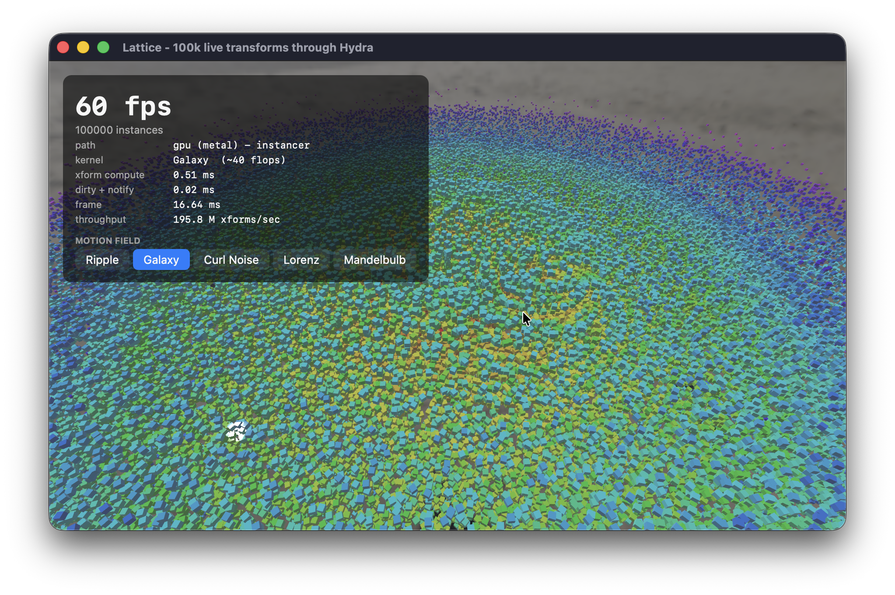

# Lattice



<p align="center">
  <sub>
    100,000 cubes moving at 60 fps. A Metal kernel writes every transform, a
    Hydra scene index reads them straight out of the store, and the <code>UsdStage</code>
    is never touched. Lattice's share of the 16.64 ms frame is 0.53 ms.
  </sub>
</p>

A Swift-native, open-source runtime data store for real-time scenes -
the same problem [NVIDIA's Fabric/USDRT](https://docs.omniverse.nvidia.com/kit/docs/usdrt.scenegraph/latest/usd_fabric_usdrt.html)
solve inside Omniverse, built as its own thing rather than a port of that API.

Lattice is not a scene graph, not a composition engine, and not tied to
USD. It's a small archetype-based store: entities, columns of component
data laid out for cache-friendly bulk iteration, and cheap structural moves
when an entity's component set changes. It's meant to sit *next to*
whatever owns your authoritative scene description - a `UsdStage` via
`LatticeUSD`, or nothing at all - the same way Fabric sits next to a stage
without replacing it.

## Why this exists

Fabric gives Omniverse a place to read and write scene data at
per-frame rates without paying USD composition and `TfNotice` overhead.
USDRT is a USD-shaped API on top of it. Neither is open source - only the
USDRT API layer ships as source/binary, and Fabric itself is developed
inside Kit. There isn't an existing open equivalent for people who want
Fabric-style performance in their own Swift engine without Omniverse.

Lattice borrows the two ideas that actually matter from Fabric's design -
bucketed, columnar storage, and cheap change tracking instead of per-value
notifications - and otherwise takes a completely Swift-native shape: no
`usdrt::UsdStage`-alike API, no attempt at source compatibility with anything
NVIDIA ships. What Fabric does with CUDA and a C++ Kit runtime, Lattice does
with Swift value types, contiguous columns, `MTLBuffer`-backed storage on
unified memory, and Swift's own concurrency for parallel iteration.

## Package layout

- **`LatticeCore`** - the core. Entities, archetypes, columns, queries, change
  tracking. No platform-specific or USD-specific code lives here; it builds
  and tests anywhere Swift runs.
- **`LatticeMetal`** - `MetalBackedColumn<T>`, a column backed by an
  `MTLBuffer` instead of a Swift array, wired into the store through a
  per-component factory. On Apple Silicon's unified memory, writes here are
  immediately visible to the GPU with no upload step:
  `store.register(Particle.self) { MetalBackedColumn<Particle>(device: device) }`.
- **`LatticeUSD`** - a thin adapter (`USDStageSourceRepresentable`) that lets any
  USD binding populate a `LatticeStore`, without Lattice depending on that
  binding's concrete API. It also holds the two objects the Hydra scene indices
  read live transforms out of: `LatticeXformSource` for per-prim transforms and
  `LatticeInstanceSource` for instance arrays.
- **`LatticeOverlays`** - small C++ helpers for the bits of OpenUSD that Swift
  can't reach directly yet, mainly zero-copy `VtArray` access.
- **`lattice`** - the C++ side of the Hydra integration: the two scene indices,
  and the small C bridge that registers them with Hydra. See [Live in Hydra](#live-in-hydra).
- **`LatticeDemo`** - `swift run -c release LatticeDemo`: spawns 100k entities
  with a `Transform`/`Velocity` pair and integrates them for 120 frames across
  the serial, parallel, and Metal GPU paths, then repeats the whole run over a
  store populated from a real `UsdStage`. See [Benchmarks](#benchmarks).
- **`LatticeHydraDemo`** - `swift run -c release LatticeHydraDemo`: the same
  store, this time driving a live Hydra viewport with 100k moving cubes. See
  [Live in Hydra](#live-in-hydra).

## Benchmarks

100,000 entities, 120 frames, one `Transform`/`Velocity` pair each, integrated
with a deliberately compute-bound per-entity kernel (32 iterations of trig +
`sqrt` - the scenario where throughput, not memory or dispatch overhead, decides).
Every path runs identical math, the GPU folds 30 frames into each dispatch to
amortize command-buffer cost. Release build, base **2026 Apple MacBook Air M5**
(10-core, unified memory).

| Path | Per-frame | vs serial CPU | vs parallel CPU |
| :--- | ---: | ---: | ---: |
| CPU - serial | 33.8 ms | 1× | - |
| CPU - parallel | 6.35 ms | 5.3× | 1× |
| **GPU - Metal, unified memory** | **0.13 ms** | **254×** | **48×** |

Driven end-to-end through `LatticeUSD` - 100k prims authored into a `UsdStage`,
loaded, and mirrored into the store via `USDPopulationSync` - the frame loop hits
the same numbers (**228×** serial, **45×** parallel), with the one-time USD->store
population costing ~1.1 s.

> [!NOTE]
> This is illustrative of the architecture, not a head-to-head benchmark
> against Fabric/USDRT (which use different hardware, kernels, and APIs).
> The core takeaway is that a Swift-native, columnar `MTLBuffer` on
> unified memory achieves GPU-throughput territory on the exact same
> per-frame simulation patterns Fabric targets - entirely bypassing the
> need for a separate upload step, CUDA, or the Kit runtime.

## Live in Hydra

`LatticeHydraDemo` runs the store behind a live Hydra viewport.

The cubes are written into a `UsdStage` once, at startup, and after that the
stage is never touched again. Every frame a Metal kernel rewrites all 100,000
transforms in a `MetalBackedColumn`, and a scene index hands those to Hydra
when it asks for a prim - so Hydra reads the store, not the stage.

The stage still holds the scene as authored, and the motion lives somewhere
that can keep up with a frame. That's the same division Fabric uses inside
Omniverse, done here as a Hydra scene index.

### The scene shape decides the frame time, not the store

The demo can run the same store and the same kernel two ways. The only thing
that changes is how many prims Hydra has to be told about, and that turns out
to be what decides the frame time. Release build, same base **2026 Apple
MacBook Air M5** (10-core, unified memory) as the benchmarks above, 100k cubes,
`Ripple` kernel, Storm:

| 100k cubes | xform compute | dirty + notify | frame |
| :--- | ---: | ---: | ---: |
| `--per-prim` - one `Cube` prim each | 0.35 ms | 56.23 ms | 1033 ms |
| instancer - one `UsdGeomPointInstancer` | 0.43 ms | **0.07 ms** | **26 ms** |

With one prim per cube, Hydra re-syncs 100,000 prims every frame, and we have
to hand it 100,000 dirty paths to make that happen. The instancer replaces
three arrays on a single prim instead, so there's one dirty path no matter how
many cubes there are. That's roughly 800× less time spent notifying and 40×
less per frame, with the store doing exactly the same work either way.

Lattice costs under half a millisecond in both. Everything else in the frame
dwarfs it.

> [!NOTE]
> These are read off the demo's HUD, not a proper benchmark harness, and
> `frame` includes Storm drawing and presenting. The gap between the two rows
> is the part that carries over to other machines - it comes from prim counts,
> not from this laptop.

### The frame contract

Hydra calls `GetPrim()` from several threads at once, so writing to the store
while it reads would corrupt it. The frame is split into two phases, and
`LatticeFramePhase` asserts on the split in debug builds:

```
mutate -> advanceChangeTick() -> sceneIndex.Tick() -> beginReadPhase()
       -> Hydra pulls GetPrim() -> endReadPhase()
```

`Hydra.FrameDelegate` provides those two hooks. By the time the read phase
opens, everything Hydra is about to ask for has been written and marked dirty.

### Motion fields, switchable live

Five kernels. Each one works out where a cube should be from its home position
and the clock, and nothing else - nothing carried over from last frame, nothing
shared between cubes. That's what makes them easy to run in parallel, and it's
also why you can switch between them while it's running with nothing to reset.
They're all compiled at startup, so switching is instant:

| Kernel | Motion | Per-instance cost |
| :--- | :--- | :--- |
| Ripple | spherical wave from the centre | ~20 flops |
| Galaxy | differential rotation winds a grid into spiral arms | ~40 flops |
| Curl Noise | divergence-free curl of an fbm vector potential | 18 fbm, 3 octaves |
| Lorenz | the attractor, re-integrated from home every frame | 128 Euler steps |
| Mandelbulb | distance estimation with an animated exponent | 16 iters, `pow`/`acos`/`atan2` |

Clicking down that list is the fun part. `xform compute` goes up roughly
tenfold from top to bottom, and the frame time barely moves.

```pwsh
export SWIFTUSD_BUILD_FROM_SOURCE=1

swift run -c release LatticeHydraDemo                 # instancer + GPU, 100k
swift run -c release LatticeHydraDemo --count 250000  # more
swift run -c release LatticeHydraDemo --per-prim      # the per-prim comparison
swift run -c release LatticeHydraDemo --cpu           # parallel-CPU path (ripple only)
```

## Core concepts

- **`LatticeEntity`** - a dense index/generation handle. No data, no path,
  no name. Just an identity.
- **`LatticeComponent`** - marker protocol for a storable value type.
- **`Archetype`** - a bucket of entities sharing exactly the same component
  types, holding one densely packed column per type.
- **`LatticeStore`** - owns every archetype, and is the only place that
  moves an entity between archetypes when you `set`/`remove` a component
  type it didn't previously have.
- **`Query1<A>` ... `Query4<A, B, C, D>`** - read or mutate matching entities by
  iterating archetype columns directly, not by looking entities up one at a
  time. Iteration hands the closure contiguous buffers so the loop vectorizes;
  `forEachMutatingFirstParallel` fans the same work across cores.
- **`mutationGeneration(of:)`** - a coarse "did anything of this component
  type change" counter, standing in for `TfNotice`.
- **`currentTick` / `forEachChanged(since:)`** - per-row change detection:
  every write stamps the row with a monotonic tick, so a system can touch only
  the entities whose component changed since it last ran (Bevy-style), the
  fine-grained counterpart to `mutationGeneration(of:)`.

```swift
let store = LatticeStore()

// No registration step needed - set/spawn register a component on first use.
let entity = store.spawn(
    Transform(x: 0, y: 0, z: 0),
    Velocity(dx: 1, dy: 0, dz: 0)
)

// Bulk-iterate matching entities over contiguous columns.
store.query(Transform.self, Velocity.self).forEachMutatingFirst { _, transform, velocity in
    transform.x += velocity.dx
}

// The same loop, fanned out across cores (data-parallel, single-writer for structure):
store.query(Transform.self, Velocity.self).forEachMutatingFirstParallel { transform, velocity in
    transform.x += velocity.dx
}
```

## Concurrency model

Fabric exists so many systems can read and write scene data per frame without
serializing on composition. Lattice takes the same position with a clear,
enforceable contract:

- **Value mutation is data-parallel.** `forEachMutatingFirstParallel` splits an
  archetype's rows into contiguous batches across the global concurrent queue.
  Each worker owns a disjoint row range, so mutating one component while reading
  others needs no locking. This is the embarrassingly-parallel per-frame
  simulation path.
- **Structural change is single-writer.** `spawn`, `despawn`, `set`-that-adds-a
  -type, and `remove` move entities between archetypes and mutate shared
  indices. They must not run concurrently with a query. Run structural edits
  between parallel passes, not during them - the same discipline Fabric's
  bucket model requires.
- **Systems run in parallel across disjoint access sets.** A `LatticeSystem`
  declares the component types it reads and writes; `LatticeScheduler` groups
  non-conflicting systems into waves that run concurrently, ordering only the
  pairs that actually conflict (write-write, or read-vs-write on the same type).
  This is the across-systems complement to the within-a-query parallelism above
  - the scheduling model Fabric uses to fill a frame across cores.

```swift
let scheduler = LatticeScheduler()
scheduler.add(LatticeSystem("integrate", reads: [Velocity.self], writes: [Transform.self]) { store in
    store.query(Transform.self, Velocity.self).forEachMutatingFirst { _, t, v in t.x += v.dx }
})
scheduler.add(LatticeSystem("regen", writes: [Health.self]) { store in
    store.query(Health.self).forEachMutating { _, h in h.hp += 1 }
})
scheduler.run(on: store)   // integrate and regen touch different types -> one concurrent wave
```

## What's implemented

- **Optional registration.** `set`/`spawn` register a component the first time
  they see it; there's no mandatory startup step. `register(_:columnFactory:)`
  remains, now solely to choose a component's backing storage.
- **Selectable column backing.** Columns are created through a per-component
  factory, so a type can live in a plain array (`TypedColumn`) or directly in
  an `MTLBuffer` (`MetalBackedColumn`) - queries drive either transparently
  through the `TypedColumnStorage` protocol. `MetalBackedColumn` also exposes a
  `bufferGeneration` so a renderer knows when a growth reallocation invalidated
  the buffer it had bound.
- **Two-level change detection.** The coarse `mutationGeneration(of:)` answers
  "did any `T` change"; per-row change ticks (`currentTick`,
  `forEachChanged(since:)`) answer "*which* entities' `T` changed", and ticks
  are preserved across archetype moves so an unrelated add/remove never looks
  like a value edit.
- **Queries up to arity four**, with vectorizable contiguous iteration, the
  parallel mutation path above, and `excluding:` negative filters
  (`store.query(Transform.self, excluding: Hidden.self)`).
- **A system scheduler** (`LatticeSystem` / `LatticeScheduler`) that runs
  systems concurrently when their declared read/write sets are disjoint, and
  orders the conflicting pairs.
- **USD population, synchronization, *and* write-back - the full loop.**
  `syncAll()` does one-time population; `syncIncremental()` diffs the stage's
  current prim set against the last-seen set and spawns/despawns only the delta;
  `writeBackChanged(...)` authors component values back onto stage attributes,
  touching only the rows that changed since a given tick (via the same per-row
  change ticks). That's USDRT's population-vs-synchronization split plus the
  return path. `USDStageSource` is a concrete `USDStageSourceRepresentable`
  backed by a real `UsdStage` via `wabiverse/swift-usd`.
- **A live Hydra path.** Two scene indices - `LatticeHydraSceneIndex` for
  per-prim transforms, `LatticeInstancerSceneIndex` for instance arrays - feed
  Hydra from the store without touching the stage. The read/write phase split
  is asserted in debug builds, not just written down.
  See [Live in Hydra](#live-in-hydra).

## Roadmap

What's genuinely still ahead, in rough priority:

- **Query arity beyond four** via parameter packs rather than more overloads,
  and **optional components** in a query (visit entities with `A`, and `B` if
  present).
- **Structural commands buffered from within systems** - let a scheduled system
  record spawn/despawn/add/remove requests that the store applies at the wave
  barrier, so structural change composes with the parallel scheduler instead of
  sitting strictly between runs.
- **Write-back driven by an execution graph.** `writeBackChanged` already closes
  the store->stage loop by change tick; wiring it to `ExecUsdSystem`'s
  invalidation graph would let recompute *and* write-back share the one signal
  that already knows what's dirty.
- **Zero-copy arrays across the scene index boundary.** `VtArray`'s foreign data
  source hook could be utilized to reference the `MTLBuffer` directly, making the
  whole path allocation-free.

## Integrating with `wabiverse/swift-usd`

`LatticeUSD` depends on `OpenUSDKit` from `wabiverse/swift-usd` and ships
`USDStageSource`, a concrete `USDStageSourceRepresentable` backed by a
real `UsdStage`: it traverses the composed stage for prim paths and reads
resolved attribute values, mapping USD value types to `LatticeUSDValue`.

```pwsh
git clone https://github.com/wabiverse/Lattice.git
cd Lattice

# since apple/SwiftUsd does not yet expose zero-copy
# read-only buffer access via VtArray::cdata(), or
# single-copy construction from a contiguous buffer
# issue: https://github.com/apple/SwiftUsd/issues/34
# this will require building OpenUSD from source with
# the following environment variable:
export SWIFTUSD_BUILD_FROM_SOURCE=1

# benchmark your own production scene
swift run -c release LatticeDemo --usd /path/to/stage.usda
```

```swift
let source = USDStageSource(openingStageAt: "scene.usd")
let sync = USDPopulationSync(store: store, paths: paths, source: source)
sync.syncAll()   // one-time population
sync.populate(Transform.self, from: "xformOp:translate") { value in
    guard case let .float3(x, y, z) = value else { return nil }
    return Transform(x: x, y: y, z: z)
}
// Later, each frame the stage's prim set can change:
sync.syncIncremental()   // spawns/despawns only the delta
```

If we extend `ExecUsdSystem` to write its computed values (posed
transforms, bounds) into a `LatticeStore` - rather than only handing
back an `ExecUsdCacheView` - we'd close a real gap. OpenExec does
not currently author values back into scene description, it only
observes the stage and returns results via a cache view. Fabric
gets store-plus-invalidation writes today, but through OmniGraph,
not OpenExec. I haven't found anything public that pairs Pixar's
own schema-aware execution system with a Fabric-style store - if
that exists already, I'd love to know - but if not, this would
give OpenExec's invalidation graph a real place to write.
